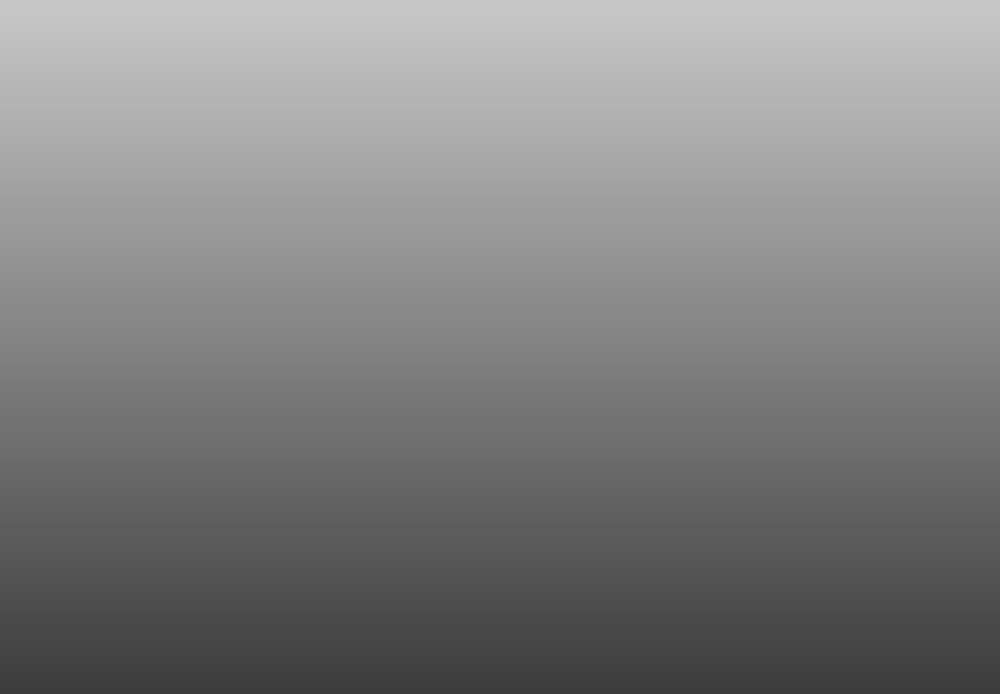

# CSS, advanced: SmileSchool

This project turns the SmileSchool designer file (Figma) into a styled web page using only HTML and CSS. Starting from the HTML built in the previous `HTML, advanced` project, it adds the styling for each part of the page: the header and banner, the quote, the most popular tutorials list, the free membership block, the F.A.Q. and the footer. The goal is to match the design exactly (colors, widths, heights, fonts, and images) while keeping the CSS simple, with clean and reusable selectors.

## Structure

| Task | Content |
|------|---------|
| `task_0` | README and starting `index.html` |
| `task_1` | `styles.css` created and imported in the `head` of `index.html` |
| `task_2` | Header and banner |
| `task_3` | Quotes section |
| `task_4` | Videos list section |
| `task_5` | Membership section |
| `task_6` | F.A.Q. section |
| `task_7` | Footer |

Each task folder contains the page and its stylesheet as they stand at the end of that task.

## Fonts

Source Sans Pro (loaded from Google Fonts in `index.html`).
