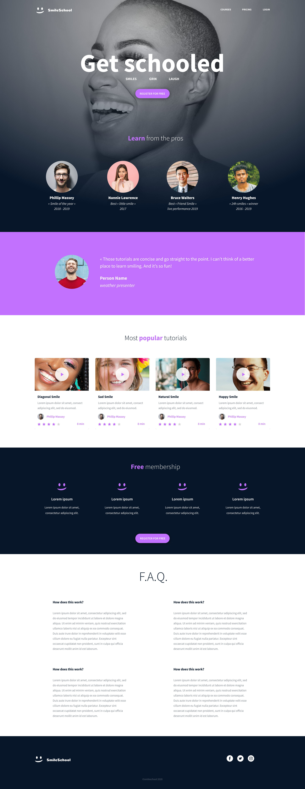

# CSS advanced - SmileSchool

This project styles, with pure CSS, the SmileSchool web page built in the HTML advanced project, following the Figma designer file pixel by pixel.
Each task adds the style of one part of the page: the header and banner, the quote, the most popular tutorials, the free membership, the F.A.Q. and the footer.
The page uses the Source Sans Pro font, a simple flexbox layout and a few shared rules for titles, buttons and grids.
It is deployed with GitHub Pages.

## Tasks

| Task | Files | Content |
| --- | --- | --- |
| 0 | `task_0/README.md`, `task_0/index.html` | This README and the HTML page |
| 1 | `task_1/index.html`, `task_1/styles.css` | Stylesheet imported in the page |
| 2 | `task_2/styles.css` | Header and banner |
| 3 | `task_3/styles.css` | Quote |
| 4 | `task_4/styles.css` | Videos list |
| 5 | `task_5/styles.css` | Membership |
| 6 | `task_6/styles.css` | FAQ |
| 7 | `task_7/styles.css` | Footer |

Live page: https://elvinaliyevse-lab.github.io/holbertonschool-web-development/css_advanced/task_7/

## Author

Elvin Aliyev
